# The Schwarzenegger - Developer Guide
By: `CS2113T-F11-1` Since: `2020`

  


## Table of Contents
1. [**Introduction**](#intro)<br>
1.1. [Background](#background)<br>
1.2. [Purpose](#purpose)<br>
1.3. [Scope](#scope)<br>
2. [**Setting Up**](#setting-up)<br>
2.1. [Prerequisites](#prerequisites)<br>
2.2. [Setting up the Project in Your Computer](#setting-up-the-project-in-your-computer)<br>
3. [**Design**](#design)<br>
3.1. [Architecture](#architecture)<br>
3.2. [Ui Component](#ui-component)<br>
3.3. [Logic Component](#logic-component)<br>
3.4. [Model Component](#model-component)<br>
3.5. [Storage Component](#storage-component)<br>
3.6. [Common Classes](#common-classes)<br>
4. [**Implementation**](#implementation)<br>
4.1. [Main Menu-related Features](#main-menu-related-features)<br>
&nbsp;&nbsp;&nbsp;&nbsp;4.1.1. [Help Command for Main Menu](#main-help)<br>
&nbsp;&nbsp;&nbsp;&nbsp;4.1.2. [Redirecting to Profile Menu](#redirection-to-profile-menu)<br>
&nbsp;&nbsp;&nbsp;&nbsp;4.1.3. [Redirecting to Diet Menu](#redirection-to-diet-menu)<br>
&nbsp;&nbsp;&nbsp;&nbsp;4.1.4. [Redirecting to Workout Menu](#redirecting-to-workout-menu)<br>
4.2. [Profile-related Features](#profile-related-features)<br>
&nbsp;&nbsp;&nbsp;&nbsp;4.2.1. [Adding a Profile](#adding-a-profile)<br>
&nbsp;&nbsp;&nbsp;&nbsp;4.2.2. [Viewing a Profile](#viewing-a-profile)<br>
&nbsp;&nbsp;&nbsp;&nbsp;4.2.3. [Editing a Profile](#editing-a-profile)<br>
&nbsp;&nbsp;&nbsp;&nbsp;4.2.4. [Deleting a Profile](#deleting-a-profile)<br>
4.3. [Diet-related Features](#43-diet-related-features)<br>
&nbsp;&nbsp;&nbsp;&nbsp;4.3.1. [List out all commands](#431-list-out-all-commands)<br>
&nbsp;&nbsp;&nbsp;&nbsp;4.3.2. [Start recording diet data](#432-start-recording-diet-data)<br>
&nbsp;&nbsp;&nbsp;&nbsp;&nbsp;&nbsp;&nbsp;&nbsp;4.3.2.1. [Showing help message](#4321-showing-help-message)<br>
&nbsp;&nbsp;&nbsp;&nbsp;&nbsp;&nbsp;&nbsp;&nbsp;4.3.2.2. [Adding food items for the current diet](#4322-adding-food-items-for-the-current-diet)<br>
&nbsp;&nbsp;&nbsp;&nbsp;&nbsp;&nbsp;&nbsp;&nbsp;4.3.2.3. [Listing data for the current diet](#4323-listing-data-for-the-current-diet)<br>
&nbsp;&nbsp;&nbsp;&nbsp;&nbsp;&nbsp;&nbsp;&nbsp;4.3.2.4. [Deleting data from the current diet](#4324-deleting-data-from-the-current-diet)<br>
&nbsp;&nbsp;&nbsp;&nbsp;&nbsp;&nbsp;&nbsp;&nbsp;4.3.2.5. [Clearing data from the current diet](#4325-clearing-data-from-the-current-diet)<br>
&nbsp;&nbsp;&nbsp;&nbsp;&nbsp;&nbsp;&nbsp;&nbsp;4.3.2.6. [Stopping the recording of diet data](#4326-stopping-the-recording-of-diet-data)<br>
&nbsp;&nbsp;&nbsp;&nbsp;4.3.3. [List all past diet sessions](#433-list-all-past-diet-sessions)<br>
&nbsp;&nbsp;&nbsp;&nbsp;4.3.4. [Edit a past diet session](#434-edit-a-past-diet-session)<br>
&nbsp;&nbsp;&nbsp;&nbsp;4.3.5. [Delete a past diet session](#435-delete-a-past-diet-session)<br>
&nbsp;&nbsp;&nbsp;&nbsp;4.3.6. [Clear all past diet sessions](#436-clear-all-past-diet-sessions)<br>
&nbsp;&nbsp;&nbsp;&nbsp;4.3.7. [Exit the diet manager](#437-exit-the-diet-manager)<br>
4.4. [Workout-related Features](#workout-related-features)<br>
&nbsp;&nbsp;&nbsp;&nbsp;4.4.1. [Creating a New Workout Session](#creating-a-new-workout-session)<br>
&nbsp;&nbsp;&nbsp;&nbsp;&nbsp;&nbsp;&nbsp;&nbsp;4.4.1.1. [Adding an Exercise](#adding-an-exercise)<br>
&nbsp;&nbsp;&nbsp;&nbsp;&nbsp;&nbsp;&nbsp;&nbsp;4.4.1.2. [Deleting an Exercise](#deleting-an-exercise)<br>
&nbsp;&nbsp;&nbsp;&nbsp;&nbsp;&nbsp;&nbsp;&nbsp;4.4.1.3. [Listing All Exercises in This Session](#listing-all-exercises-in-this-session)<br>
&nbsp;&nbsp;&nbsp;&nbsp;&nbsp;&nbsp;&nbsp;&nbsp;4.4.1.4. [Allowing users to view help commands](#4414-Allowing-users-to-view-help-commands)<br>
&nbsp;&nbsp;&nbsp;&nbsp;&nbsp;&nbsp;&nbsp;&nbsp;4.4.1.5. [Searching for related exercises](#4415-Searching-for-related-exercises)<br>
&nbsp;&nbsp;&nbsp;&nbsp;&nbsp;&nbsp;&nbsp;&nbsp;4.4.1.6. [Ending the workout session](#4416-Ending-the-workout-session)<br>
&nbsp;&nbsp;&nbsp;&nbsp;4.4.2. [Listing past workout sessions](#442-listing-past-workout-sessions)<br>
&nbsp;&nbsp;&nbsp;&nbsp;4.4.3. [Editing workout session](#443-editing-workout-session)<br>
&nbsp;&nbsp;&nbsp;&nbsp;4.4.4. [Deleting a workout session](#444-deleting-a-workout-session)<br>
&nbsp;&nbsp;&nbsp;&nbsp;4.4.5. [Searching based on conditions](#445-searching-based-on-conditions)<br>
4.5. [Storage](#storage)<br>
&nbsp;&nbsp;&nbsp;&nbsp;4.5.1. [Storage for Profile](#storage-for-profile)<br>
&nbsp;&nbsp;&nbsp;&nbsp;4.5.2. [Storage for Diet](#storage-for-diet)<br>
&nbsp;&nbsp;&nbsp;&nbsp;4.5.3. [Storage for Workout](#storage-for-workout)<br>
4.6. [Logging](#logging)<br>
5. [**Testing**](#testing)<br>
5.1. [Running Tests](#running-tests)<br>
5.2. [Types of Tests](#types-of-tests)<br>
6. [**Dev Ops**](#dev-ops)<br>
6.1. [Build Automation](#build-automation)<br>
6.2. [Continuous Integration](#continuous-integration)<br>
6.3. [Coverage Report](#coverage-report)<br>
6.4. [Making a Release](#making-a-release)<br>
6.5. [Managing Dependencies](#managing-dependencies)<br>
  * [**Appendices**](#appendices)
    + [Appendix A: Product Scope](#appendix-a-product-scope)
    + [Appendix B: User Stories](#appendix-b-user-stories)
    + [Appendix C: Value proposition - Use cases](#appendix-c-value-proposition---use-cases)
    + [Appendix D: Non-Functional Requirements](#appendix-d-non-functional-requirements)
    + [Appendix E: Glossary](#appendix-e-glossary)
    + [Appendix F: Supported Formats of Date Input](#appendix-f-supported-formats-of-date-input)

## 1. <a id="intro">Introduction</a>
### 1.1.  <a id="background">Background</a>
The Schwarzenegger is a desktop command line interface-based app for managing all your needs regarding fitness. With the built-in personal assistant, you are able to track your daily workout and diet sessions based on your profile. If you can type fast, The Schwarzenegger can help you maximise your efficiency for maintaining fitness.
### 1.2. <a id="purpose">Purpose</a>
This document contains the specified architecture and software design specifications for the application, The Schwarzenegger. 
### 1.3. <a id="scope">Scope</a>
This document describes the software architecture and software design requirements for The Schwarzenegger. This guide is mainly for developers, designers and software engineers that are or going to work on The Schwarzenegger.

<a href="#top">&#8593; Return to Top</a>

## 2. <a id="setting-up">Setting Up</a>

### 2.1. <a id="prerequisites">Prerequisites</a>
1. JDK `11`.
2. IntelliJ IDEA IDE.

### 2.2. <a id="setting-up-the-project-in-your-computer">Setting up the Project in Your Computer</a>
1. Fork [this repository](https://github.com/AY2021S1-CS2113T-F11-1/tp), and clone the fork to your computer.
2. Open IntelliJ (if you are not in the welcome screen, click `File` > `Close Project` to close the existing project dialog first).
3. Set up the correct JDK version for Gradle  
   1. Click `Configure` > `Structure for New Projects` and then `Project Settings` > `Project` > `Project SDK`.
   2. If `JDK 11` is listed in the drop down, select it. Otherwise, click `New…` and select the directory where you installed `JDK 11`.
   3. Click `OK`.
4. Click `Import Project`.
5. Locate the `build.gradle` file and select it. Click `OK`.
6. Click `Open as Project`.
7. Click `OK` to accept the default settings if prompted. 

[&#8593; Return to Top](#developer-guide)

## 3. <a id="design">Design</a>
This section provides a high level overview of our application, The Schwarzenegger.
### 3.1. <a id="architect">Architecture</a>

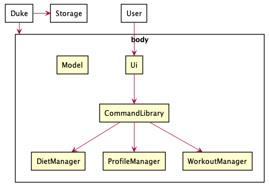

The image above explains the design of the application, The Schwarzenegger. 

The main driver of the application is `Main: Duke`. It is responsible for mainly two phases:
- At application launch
    - This class will initialise the components in the correct sequence and is in charge of connecting them with each other.
- At shut down
    - This class will invoke cleanup method for the components when necessary.
    
In addition to that, the architecture of The Schwarzenegger is broken down into several packages, mainly the following: 
- `Ui`: This class mainly handles the interactions with user of the application.
- `Parser`: This class mainly handles the parsing and handling of user commands.
- `Command`: This class handles the type of command.
- `Profile`: This class manages the data of the user.
- `Diet`: This class manages the diet recording sessions.
- `Workout`: This class manages the data workout recording sessions.
- `Storage`: This class reads data from and writes data back into a text file for future uses.

[&#8593; Return to Top](#developer-guide)

### 3.2. <a id="ui-component">Ui Component</a>


API: `Ui.java`
 
The `Ui` package is a combination class where all interaction will be made through this component
 
The `Ui` component,

* Takes in user input
* Prints out response messages

[&#8593; Return to Top](#developer-guide)

### 3.3. <a id="logic-component">Logic Component</a>


1. `The Schwarzenegger` uses `Parser` classes to parse the user command.
2. This splits the user input into interpretable portions by other functions.

[&#8593; Return to Top](#developer-guide)

### 3.4. <a id="model-component">Model Component</a>

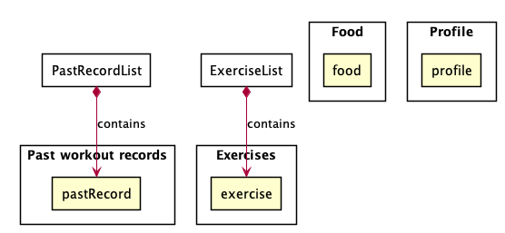

The Model component contains `Profile`, `DietManager`,
`PastRecord` and `WorkoutSession` classes.
* Profile: Stores the user profile data.
* DietManager: Stores all past diet records.
* PastRecord: Stores meta information of each WorkoutSession files.
* WorkoutSession: Stores the exercise data done in each workout session.

[&#8593; Return to Top](#developer-guide)

### 3.5. <a id="storage-component">Storage Component</a>


Profiles, Diet sessions and Workout sessions are stored in separate folders. 

The Storage package contains subpackages for profile, diet manager and workout manager.

The readDietSession() method in storage.diet package is used for loading saved diet sessions, which are loaded when the user wants to edit a past diet session.
readPastRecords() and readFileContents() methods in storage.workout package are used for loading saved workout managers and workout sessions respectively. It is called when the user accesses the workout manager.
loadData() from storage.profile is used to load user profile data and is called when the program starts up. 

The writeToStorageDietSession() method in storage.diet package saves the diet session and is called when the user exits it.
writePastRecords() and writeToStorage() methods in storage.workout package are used to save the workout managers and workout sessions respectively. It is called when the user exists the workout manager.

The saveData() method in storage.profile is called after the user creates the user profile or edits it.
readData() is storage.profile is called when duke starts up.

[&#8593; Return to Top](#developer-guide)

### 3.6. <a id="common-classes">Common Classes</a> 
Classes used by multiple components are in the `seedu.duke` and the `ui` package, specifically Constant.java and CommonUi.java.

[&#8593; Return to Top](#developer-guide)

## 4. <a id="implementation">Implementation</a>
This section describes some details on how the features are being implemented. All profile/ diet/ workout-related features.


All profile/ diet/ workout-related features can be broken down into 4 distinct functionality, addition, viewing/ listing, deletion and editing.
For diet and workout-related features, there is an additional functionality of searching.

### 4.1. <a id="main-menu-related-features">Main Menu-related Features</a>

#### 4.1.1. <a id="main-help">Help Command for Main Menu</a>

The `help` command allows users to view all the available commands in the main page. The command for showing help message is `help`.

#### 4.1.2. <a id="redirecting-to-profile-menu">Redirecting to Profile Menu</a>

The redirection to profile page allows the user to enter Profile Menu to create, edit, view and delete user profile. The command for this redirection is `profile`.

#### 4.1.3. <a id="redirecting-to-diet-menu">Redirecting to Diet Menu</a>

The redirection to profile page allows the user to enter Diet Menu to create, edit, list and delete diet sessions. The command for this redirection is `diet`.

#### 4.1.4. <a id="redirecting-to-workout-menu">Redirecting to Workout Menu</a>

The redirection to profile page allows the user to enter Workout Menu to create, edit, list and delete workout sessions. The command for this redirection is `workout`.

### 4.2. <a id="profile-related-features">Profile-related Features</a>
#### 4.2.1. <a id="adding-a-profile">Adding a Profile</a>

This feature allows user to add a new profile. The failure to do so will trigger an exception where the user will be notified of the reason, e.g. invalid command format. The action will be aborted, and the program will advise the user to type "help" for command syntax reference. 

If the creation is successful, a confirmation message on the newly created profile will be displayed to the user. 

**Implementation**

When the user attempts to add a new profile, the ProfileSession, Ui, ProfileParser, Command, CommandLib, ProfileStorage, Profile and CommandResult classes will be accessed, and the following sequence of actions is called to prompt execution result to user:

1. User executes `add /n Schwarzenegger /h 188 /w 113 /e 100 /c 2500`
    1. `ProfileSession` calls `Ui.getCommand()` to receive user input.
    1. `ProfileSession` calls `ProfileParser.parseCommand()` to parse user input into a string array.
1. Creating `ProfileAdd` object.
    1. Based on the parsed input, `ProfileSession` calls `CommandLib` to return the correct Command Object `ProfileAdd`.
1. Executing command.
    1. `ProfileSession` calls `ProfileAdd.execute()` with the rest of parsed input.
    1. `ProfileAdd` calls `ProfileStorage.loadData()` to load existing profile in the system. If there is an existing profile, `ProfileAdd` returns a failure result to `ProfileSession`. Otherwise, the process continues with step `3`.
    1. `ProfileAdd` calls `ProfileParser.extractCommandTagAndInfo()` to parse user input into specific tags and information. 
    1. Based on the parsed information from `ProfileParser.extractCommandTagAndInfo()`, `ProfileAdd` creates a new `Profile`.
    1. `ProfileAdd` calls `ProfileStorage.saveData()` to save the `Profile` object.
    1. `ProfileAdd` returns a successful result to `ProfileSession`.
1. Prompting result to user.
    1. `ProfileSession` calls `CommandResult.getFeedbackMessage()` to get the execution feedback message.
    1. `ProfileSession` calls `Ui.showToUser()` to show result to the user.

All descriptions, warnings and responses will be handled by `Ui` to ensure consistence across the app.

The sequence diagram below summarizes how creating a new profile works:

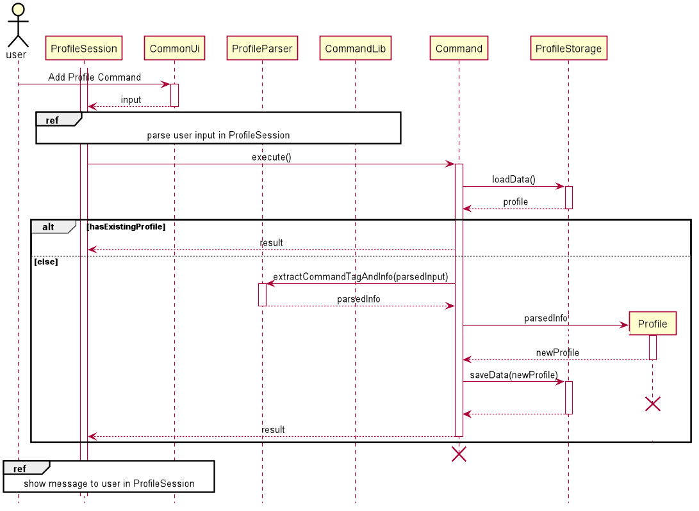

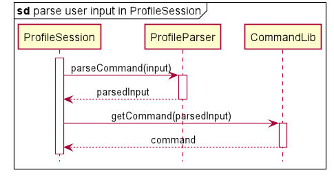

**Design considerations**

Parsing of the user’s input command:

- **Alternative 1 (current choice):** User’s command is split into size 2 array first containing command type and command arguments. Then arguments are split into command tag and information pairs.  

    - Pros: Command tags do not have to follow a fixed order. 
    - Cons: It takes multiple steps in parsing the command.

- **Alternative 2:** User’s command is divided by space.

    - Pros: The parsing can be easily done by calling Java built-in function `split()`. Supports multiple tags or no tags.
    - Cons: Values for each variable cannot contain spaces which makes the application restrictive, especially for user's name.

[&#8593; Return to Top](#developer-guide)

#### 4.2.2. <a id="viewing-a-profile">Viewing a Profile</a>
This feature allows user to view added profile with calculated BMI based on height and weight. The failure to do so will trigger an exception where the user will be notified of the reason, e.g. redundant parameters. The action will be aborted, and the program will advise the user to type "help" for command syntax reference. 

If the data loading is successful, a message on the added profile will be displayed to the user. 

**Implementation**

When the user attempts to view an added profile, the ProfileSession, Ui, ProfileParser, Command, CommandLib, ProfileStorage, Profile, DietManager and CommandResult classes will be accessed. The following sequence of steps will then occur:

1. User executes `view`
    1. `ProfileSession` calls `Ui.getUserCommand()` to receive user input.
    1. ProfileSession` calls `ProfileParser.parseCommand()` to parse user input into a string array.
1. Creating `ProfileView` object.
    1. Based on the parsed input, `ProfileSession` calls `CommandLib` to return the correct Command Object `ProfileView`.
1. Executing command.
    1. `ProfileSession` calls `ProfileView.execute()` with the rest of parsed input.
    1. `ProfileView` calls `ProfileStorage.loadData()` to load existing profile in the system. If there is no existing profile, `ProfileView` returns a failure result to `ProfileSession`. Otherwise, the process continues with step `3`.
    1. `ProfileView` calls `DietManager.getTodayTotalCalories()` to get user's calories intake today.
    1. Based on user's calories intake today and string representation of `Profile`, `ProfileView` returns a result to `ProfileSession`.    
1. Prompting result to user.
    1. `ProfileSession` calls `CommandResult.getCommandResult()` to get the `CommandResult` object.
    1. `ProfileSession` calls `Ui.showToUser()` to show result to the user.

All descriptions, warnings and responses will be handled by `Ui` to ensure consistence across the app.

The sequence diagram below summarizes how viewing an added profile works:


**Design considerations**

Aspects: Loading of stored data

- **Alternative 1 (current choice):** call public methods of Storage class to 
load the profile from hard disk every time the user wants to view profile.

    - Pros: Profile data is up-to-date if the user prefers to edit it in text file rather than using commands in The Schwarzenegger.
    - Cons: Execution time is slow down due to multiple times of loading the data.

- **Alternative 2:** call public methods of Storage class to load the profile from hard disk only when user enters Profile Menu.

    - Pros: Execution time is fast. 
    - Cons: Profile data is not updated in real time if user edits it in text editor while running The Schwarzenegger.

[&#8593; Return to Top](#developer-guide)

#### 4.2.3. <a id="editing-a-profile">Editing a Profile</a>
This feature allows user to anytime go back to edit a profile created in the past such as editing physique data and expected daily calories intake. The failure to do so will trigger an exception where the user will be notified of the reason, e.g. invalid command format. The action will be aborted, and the program will advise the user to type "help" for command syntax reference. 

If the editing is successful, a confirmation message on the edited profile will be displayed to the user. 

**Implementation**

When the user attempts to edit a profile, the ProfileSession, Ui, ProfileParser, Command, CommandLib, ProfileStorage, Profile and CommandResult classes will be accessed, and the following sequence of actions is called to prompt execution result to user:

1. User executes `edit /w 60`
    1. `ProfileSession` calls `Ui.getCommand()` to receive user input.
    1. `ProfileSession` calls `ProfileParser.parseCommand()` to parse user input into a string array.
1. Creating `ProfileEdit` object.
    1. Based on the parsed input, `ProfileSession` calls `CommandLib` to return the correct Command Object `ProfileEdit`.
1. Executing command.
    1. `ProfileSession` calls `ProfileEdit.execute()` with the rest of parsed input.
    1. `ProfileEdit` calls `ProfileStorage.loadData()` to load existing profile in the system. If there is no existing profile, `ProfileAdd` returns a failure result to `ProfileSession`. Otherwise, the process continues with step `3`.
    1. `ProfileEdit` calls `ProfileParser.extractCommandTagAndInfo()` to parse user input into specific tags and information.
    1. Based on the parsed information from `ProfileParser.extractCommandTagAndInfo()`, `ProfileEdit` creates a new `Profile`.
    1. `ProfileEdit` calls `Profile.equals()` to compare the newly created and existing profile. If there are no changes, `ProfileEdit` returns a failure result to `ProfileSession`. Otherwise, the process continues with step `6`.
    1. `ProfileEdit` calls `ProfileStorage.saveData()` to save the newly created `Profile` object.
    1. `ProfileAdd` returns a successful result to `ProfileSession`.
1. Prompting result to user.
    1. `ProfileSession` calls `CommandResult.getFeedbackMessage()` to get the execution feedback message.
    1. `ProfileSession` calls `Ui.showToUser()` to show result to the user.

All descriptions, warnings and responses will be handled by `Ui` to ensure consistence across the app.

The sequence diagram below summarizes how creating a new profile works:


**Design considerations**

Parsing of the user’s input command:

- **Alternative 1 (current choice):** User’s command is split into size 2 array first containing command type and command arguments. Then arguments are split into command tag and information pairs.  

    - Pros: Command tags do not have to follow a fixed order.
    - Cons: It takes multiple steps in parsing the command.

- **Alternative 2:** User’s command is divided by space.

    - Pros: The parsing can be easily done by calling Java built-in function `split()`. Supports multiple tags or no tags.
    - Cons: Values for each variable cannot contain spaces which makes the application restrictive.

[&#8593; Return to Top](#developer-guide)

#### 4.2.4. <a id="deleting-a-profile">Deleting a Profile</a>

This feature allows user to delete a profile created in the past. The failure to do so will trigger an exception where the user will be notified of the reason, e.g. redundant parameters. The action will be aborted, and the program will advise the user to type "help" for command syntax reference. 

If the deletion is successful, a confirmation message on the profile deletion will be displayed to the user. 

**Implementation**

When the user attempts to delete an added profile, the ProfileSession, Ui, ProfileParser, Command, CommandLib, ProfileStorage, Profile and CommandResult classes will be accessed. The following sequence of steps will then occur:

1. User executes `delete`
    1. `ProfileSession` calls `Ui.getUserCommand()` to receive user input.
    1. ProfileSession` calls `ProfileParser.parseCommand()` to parse user input into a string array.
1. Creating `ProfileDelete` object.
   1. Based on the parsed input, `ProfileSession` calls `CommandLib` to return the correct Command Object `ProfileDelete`.
1. Executing command.
    1. `ProfileSession` calls `ProfileDelete.execute()` with the rest of parsed input.
    1. `ProfileDelete` calls `ProfileStorage.loadData()` to load existing profile in the system. If there is no existing profile, `ProfileDelete` returns a failure result to `ProfileSession`. Otherwise, the process continues with step `3`.
    1. `ProfileDelete` calls `Ui.CheckConfirmation()` to get user's confirmation on the deletion since this action is irrevocable. If user  fails to confirm, `ProfileDelete` returns an abort result to `ProfileSession`. Otherwise, the process continues with step `4`.
    1. `ProfileDelete` calls `ProfileStorage.saveData()` to save a `null` object which represents a deleted profile.
    1. `ProfileDelete` returns a result to `ProfileSession`.   
1. Prompting result to user.
    1. `ProfileSession` calls `CommandResult.getFeedbackMessage()` to get the execution feedback message.
    1. `ProfileSession` calls `Ui.showToUser()` to show result to the user.

All descriptions, warnings and responses will be handled by `Ui` to ensure consistence across the app.

The sequence diagram below summarizes how deleting an added profile works:


**Design considerations**

Aspects: Loading of stored data

- **Alternative 1 (current choice):** call public methods of Storage class to load the profile from hard disk every time the user wants to delete profile.

    - Pros: Profile data is up-to-date if the user prefers to edit it in text file rather than using commands in The Schwarzenegger.
    - Cons: Execution time is slow down due to loading the data.

- **Alternative 2:** call public methods of Storage class to load the profile from hard disk when user enter Profile Menu.

    - Pros: Execution time is fast. 
    - Cons: Profile data is not updated in real time if user edits it in text file while running The Schwarzenegger.

### 4.3. Diet-related Features
#### 4.3.1. Listing out all commands: `help`
This command lists out all help commands in a typed list that indicates to the user all the commands available and how to use them.

**Implementation**  
When the user types `help` in a Diet Manager instance, the following sequence occurs. 
1. The user keys in `help`.
    
    1. A `DietSessionUi` component will call `dietSessionUI.getInput()`. 
    1. Input will be parsed in `processCommand()`.   
    
2. Creation of `DietSessionHelp` command object from input
    1. This will create a `DietSessionHelp()` instantiation of which the method `execute()` is called.
    
3. Executing Command
    1. The execute() method will call print out the list of commands onto the console with printHelpFormatter() from static CommonUi.java.
[&#8593; Return to Top](#developer-guide)

#### 4.3.2. Start recording diet data: `new`
The feature allows users to start recording diet data. 

**Implementation**  
When the user types `new </d [DATE]> </t [TAG]>` the following sequence occurs. 
1. The user keys in `new /d 2020-05-04 /t breakfast`.
    
    1. A `DietSessionUi` component will call `dietSessionUI.getInput()`. 
    1. Input will be parsed in `processCommand()`, which splits the input into the `command` and the `input`.   
    
2. Creation of command object from input
    1. This will create an instantiation DietSessionCreate() command object of which the method execute() is called.
    
3. Executing Command
    1. The newly created object will then create an instantiation of a `DietSession`, and call the `start()` method.

The sequence diagram below summarizes how creating new diet session works:

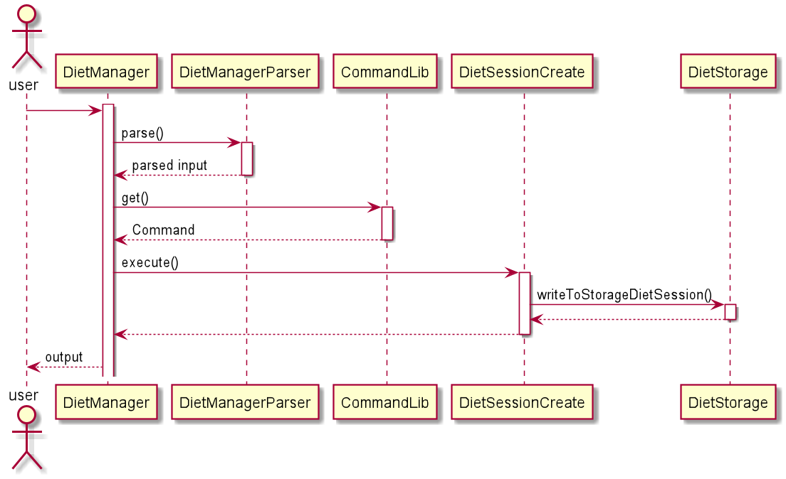

[&#8593; Return to Top](#developer-guide)

#### 4.3.2.1. Showing help message: `help`
This command lists out all help commands in a typed list that indicates to the user all the commands available and how to use them.

**Implementation**  
When the user types `help` the following sequence occurs. 
1. The user keys in `help`.
    
    1. A `DietSessionUi` instantiation calls `dietSessionUI.getInput()`. 
    1. Input will be parsed in `processCommand()`.   
    
2. Creation of command object from input
    1. This will create a `FoodItemHelp()` instantiation of which the method `execute()` is called.
    
3. Executing Command
    1. The newly created object will then print out the list of commands onto the console with printHelpFormatter() from static CommonUi.java.
    
[&#8593; Return to Top](#developer-guide)

#### 4.3.2.2. Adding food items for the current diet: `add`

The feature allows users to add food items into the current diet session. 

**Implementation**  
When the user types `add [FOOD_NAME] /c [CALORIES]` the following sequence occurs. 
1. The user keys in `add bologna /c 123`.
    
    1. A `DietSessionUi` component will call `dietSessionUI.getInput()`. 
    1. Input will be parsed in `processCommand()`.   
    
2. Creation of command object from input
    1. This will create a `FoodItemAdd()` instantiation of which the method `execute()` is called.
    1. The food component `bologna` and calories component `123` are passed into the constructor of a Food instantiation.
    
3. Executing Command
    1. The newly created food object will then be added to the `ArrayList<Food> foodList` in diet session.

The sequence diagram below summarizes how adding a new food to the diet session works:

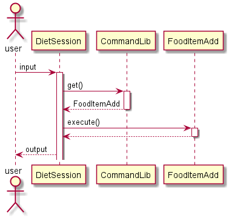

[&#8593; Return to Top](#developer-guide)

#### 4.3.2.3. Listing data for the current diet: `list`

This command allows users to view all food items in the current diet session. 

**Implementation**  
When the user types `list` the following sequence occurs. 
1. The user keys in `list`.
    
    1. A `DietSessionUi` component will call `dietSessionUI.getInput()`. 
    1. The input is then parsed in `processCommand()`.   
    
2. Creation of command object from input
    1. This will create a FoodItemList() instantiation of which the method execute() is called.
    
3. Executing Command
    1. A for loop iterates through the entire ArrayList<Food> and prints out every item with their calories.
    1. The total calories of the current meal is also printed.

#### 4.3.2.4. Deleting data from the current diet session: `delete`

The feature allows users to remove food items into the current diet session. 

**Implementation**  
When the user types `delete [INDEX_OF_FOOD]` the following sequence occurs. 
1. The user keys in `delete 1`.
    
    1. A `DietSessionUi` component will call `dietSessionUI.getInput()`. 
    1. Input will be parsed in `processCommand()`.   
    
2. Creation of command object from input
    1. This will create a `FoodItemDelete()` instantiation of which the method execute() is called.
    
3. Executing Command
    1. The Food ID according to the index based on the ArrayList<Food> is deleted.

#### 4.3.2.5. Clearing all data from the current diet session `clear`

The feature allows users to remove food items into the current diet session. 

**Implementation**  
When the user types `clear` the following sequence occurs. 
1. The user keys in `clear`.
    
    1. A `DietSessionUi` component will call `dietSessionUI.getInput()`. 
    1. Input will be parsed in `processCommand()`.   
    
2. Creation of command object from input
    1. This will create a FoodItemClear() instantiation of which the method execute() is called.
    
3. Executing Command
    1. The ArrayList Clear method is called and removes all Food entries from the ArrayList.

#### 4.3.2.6. Stopping the recording of diet session data: `end`

The feature allows users to end the current diet session and return back to the diet manager.

**Implementation**  
When the user types `end` the following sequence occurs. 
1. The user keys in `end`.
    
    1. A `DietSessionUi` component will call `dietSessionUI.getInput()`. 
    1. Input will be parsed in `processCommand()`.   
    
2. Exiting of inputLoop()
    The inputLoop() exits when userInput.equals("end").

#### 4.3.3. List all past diet sessions: `list`

The feature allows users to view all past created diet sessions.

**Implementation**  
When the user types `list` in a diet manager instance the following sequence occurs. 
1. The user keys in `list`.
    
    1. A `DietSessionUi` component will call `dietSessionUI.getInput()`. 
    1. Input will be parsed in `processCommand()`.   
    
2. Creation of command object from input
    1. This will create a FoodItemList() instantiation of which the method execute() is called.
    
3. Executing Command
    1. A for loop iterates through the entire ArrayList<Food> and prints out every item with their calories.

The sequence diagram below summarizes how listing past Diet sessions work:

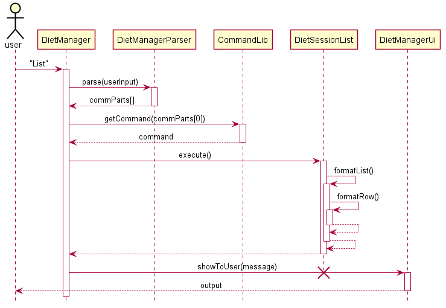
#### 4.3.4. Edit a past diet session: `edit`

The feature allows users to edit previously created diet sessions.

**Implementation**  
When the user types `edit [INDEX_OF_SESSION]` the following sequence occurs. 
1. The user keys in `edit 1`.
    
    1. A `DietSessionUi` component will call `dietSessionUI.getInput()`. 
    1. Input will be parsed in `processCommand()`.   
    
2. Creation of `DietSessionEdit` command object from input
    1. A `DietSessionEdit()` command class instantiation is created and the execute() method is called.
    
3. Executing Command
    1. This will call `readDietSession()` from `storage.diet.DietStorage` and it reads the file stored at `saves/diet`.
    1. The `start()` method is then called in the diet session, starting a diet session instance.
    
4. After Execution
    1. The diet session instance is then saved by calling `writeToStorageDietSession()` from `DietStorage`

The sequence diagram below summarizes how editing Diet session works:


**Design considerations**
Saving of the user’s Diet sessions:  

- **Alternative 1 (current choice):** Saving at the end of a diet session

    - Pros: The cost of saving is low, file writes only happen once per Diet session instance. 
    - Cons: If any crashes occur during a diet session, no input data will be saved.

- **Alternative 2:** Saving during any alterations made to the Diet session

    - Pros: The files will still be saved even if a crash occurs.
    - Cons: Saving often might be taxing on the user's computer especially on slower models.

#### 4.3.5. Delete a previously created diet session: `delete`

The feature allows users to delete previously created diet sessions.

**Implementation**  
When the user types `delete [INDEX_OF_SESSION]` from a Diet manager instance the following sequence occurs. 
1. The user keys in `delete 1`.
    
    1. A `DietSessionUi` component will call `dietSessionUI.getInput()`. 
    1. The input is then parsed in `processCommand()` which splits the input into a command portion and the input parameters.   
    
2. Creation of `DietSessionDelete()` command object from input
    1. The `CommandLib` is referenced to find information on `DietSessionDelete()`.
    2. A `DietSessionDelete()` command class instantiation is created and the `execute()` method is called.
    
3. Executing Command
    1. `DietSessionDelete()` will then delete the diet session at index `1` based on the `list` command.

The sequence diagram below summarizes how Diet sessions are deleted:

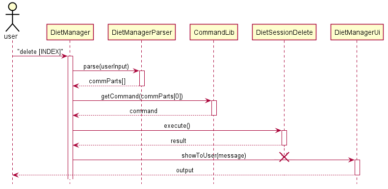
#### 4.3.6. Edit a past diet session: `clear`

The feature allows users to clear all previously created diet sessions at once.

**Implementation**  
When the user types `clear` the following sequence occurs. 
1. The user keys in `clear`.
    
    1. A `DietSessionUi` component will call `dietSessionUI.getInput()`. 
    1. Input will be parsed in `processCommand()`.   
    
2. Creation of `DietSessionClear()` command object from input
    1. The `CommandLib` is referenced to find information on `DietSessionClear()`.
    2. A `DietSessionClear()` command class instantiation is created and the `execute()` method is called.
    
3. Executing Command
    1. This will iterate through every file in saves/diet/ and delete it.

The sequence diagram below summarizes how Diet sessions are all cleared:

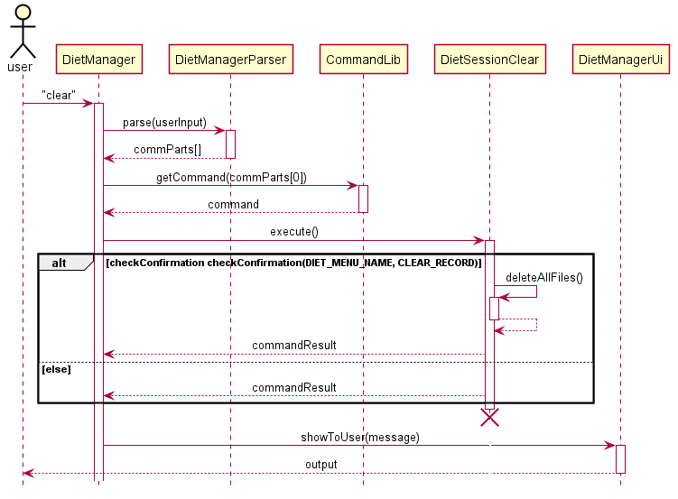
#### 4.3.7. Exit the Diet manager: `end`

The function returns the user back to the main menu of The Schwarzenegger.

**Implementation**  
When the user types `end` the following sequence occurs. 
1. The user keys in `end`.
    
    1. A `DietSessionUi` component will call `dietSessionUI.getInput()`. 
    1. Input will be parsed in `processCommand()`.  
    
2. Exiting of inputLoop()
    The inputLoop() exits when userInput.equals("end"), returning to the `Start()` method, then ending the `DietManager` instance.


[&#8593; Return to Top](#developer-guide)


### 4.4. <a id="workout-related-features">Workout-related Features</a>
#### 4.4.1. <a id="creating-a-new-workout-session">Creating a New Workout Session</a>

Users can create a new workout session. The failure to do so will trigger an exception where the user will be notified 
of the reason, e.g. invalid command or IO related errors. The action will be aborted. If the creation is successful, 
the user will go into the new workout session to edit the exercises in that session.

The user can specify tags for the session. Creation time, last edit time and saving file name will be auto generated 
by the application and saved. 

**Implementation**

When the user attempts to create a new workout session, the Ui, WorkoutManagerParser 
and CommandLib class will be accessed and the following sequence of 
actions are called to return a command object NewWs.

1. User executes `new /t leg chest`
     1. `WorkoutManager` calls `Ui.getUserCommand()` to receive user input.
     2. `WorkoutManager` calls `WorkoutManagerParser.parse` into a string array
1. Creation of command object.
     1. Based on the parsed input, `WorkoutManager` calls `CommandLib` to return the correct Command Object `NewWs`.
1. Executing Command
    1. `WorkoutManager` calls `NewWS.execute()` with the rest of parsed input.
    1. `NewWS` parse the arguments to identify the tags
    3. `NewWS` calls `PastRecordList.add()` to create a new file to store information in this session. 
    If the creation fails, the action is aborted. Else, this record will be stored and the file path will 
    be returned.
    4. `NewWS` creates a new `WorkoutSession` Object with the file path. 
    5.  `NewWS` calls `workoutSession. workoutSessionStart()` so that user can add information into this session.
    6. After user exits this workout, `WorkoutManager` returns a `CommandResult`.
1. Based on `CommandResult`, correct response will be printed to user.

All description, warnings and response will be handled by `Ui` to ensure consistence across the app.
The following sequence diagram shows how the new command works

The sequence diagram below summarizes how creating new workout session works:

**Design considerations**
Parsing of the user’s input command:  

- **Alternative 1 (current choice):** User’s commands are divided by space.

    - Pros: The parsing can be easily done by calling Java built-in function .split(). Supports multiple tags or no tags.
    - Cons: Values for each variable cannot contain spaces which makes the application restrictive.

- **Alternative 2:** Multiple prompts for user’s input of a workout data.

    - Pros: Users would not have to make sure that their command is syntactically right. 
    - Cons: The constant prompting could subject the application to a negative experience in the difficulty to use the commands.

[&#8593; Return to Top](#developer-guide)
#### 4.4.1.1. <a id="adding-an-exercise">Adding an Exercise</a>

Users can add a new exercise. The failure to do so will trigger an exception where the user will be notified of 
the reason, e.g. invalid command or IO related errors. The action will be aborted. If the addition is successful, 
a new exercise will be added to the exerciselist.

**Implementation**

When the user attempts to add a new exercise, the Ui, WorkoutSessionParser 
and CommandLib class will be accessed and the following sequence of 
actions are called.

1. User executes `add benchpress /n 6 /w 120`
     1. `WorkoutSession` calls `Ui.getUserCommand()` to receive user input.
     2. `WorkoutSession` calls `WorkoutSessionParser.workoutSessionParser` to convert the input to a string array.
1. Creation of command object.
     1. Based on the parsed input, `WorkoutManager` calls `CommandLib` to return the correct Command Object `WorkoutSessionAdd`.
1. Executing Command
    1. `WorkoutManager` calls `WorkoutSessionAdd.execute()` with the rest of parsed input.
    2. `WorkoutSessionAdd` parse the arguments to identify the repetitions and weight for the exercise.
    3. `WorkoutSessionAdd` calls `WorkOutSession.Storage.writeToFile()` to store information of all exercises recorded. 

All description, warnings and response will be handled by `ui` to ensure consistence across the app.
The following sequence diagram shows how the add command works

The sequence diagram below summarizes how creating new workout session works:
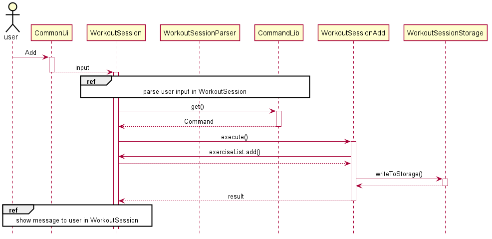

[&#8593; Return to Top](#developer-guide)
#### 4.4.1.2. <a id="deleting-an-exercise">Deleting an Exercise</a>

Users can delete an exercise from a pre-existing list of exercise. The failure to do so will trigger an exception where the user will be notified of 
the reason, e.g. invalid command or IO related errors. The action will be aborted. If the addition is successful, 
a new exercise will be added to the exerciselist.

**Implementation**

When the user attempts to delete an exercise, the Ui, WorkoutSessionParser 
and CommandLib class will be accessed and the following sequence of 
actions are called to return a command object NewWs.

1. User executes `delete 1`
     1. `WorkoutSession` calls `Ui.getUserCommand()` to receive user input.
     2. `WorkoutSession` calls `WorkoutSessionParser.workoutSessionParser` to convert the input to a string array.
1. Creation of command object.
     1. Based on the parsed input, `WorkoutManager` calls `CommandLib` to return the correct Command Object `WorkoutSessionDelete`.
1. Executing Command
    1. `WorkoutManager` calls `WorkoutSessionDelete.execute()` with the rest of parsed input.
    2. `WorkoutSessionDelete` parse the arguments to identify the repetitions and weight for the exercise.
    3. `WorkoutSessionDelete` calls `WorkOutSession.Storage.writeToFile()` to store information of all exercises recorded. 

All description, warnings and response will be handled by `ui` to ensure consistence across the app.
The following sequence diagram shows how the add command works

The sequence diagram below summarizes how creating new workout session works:
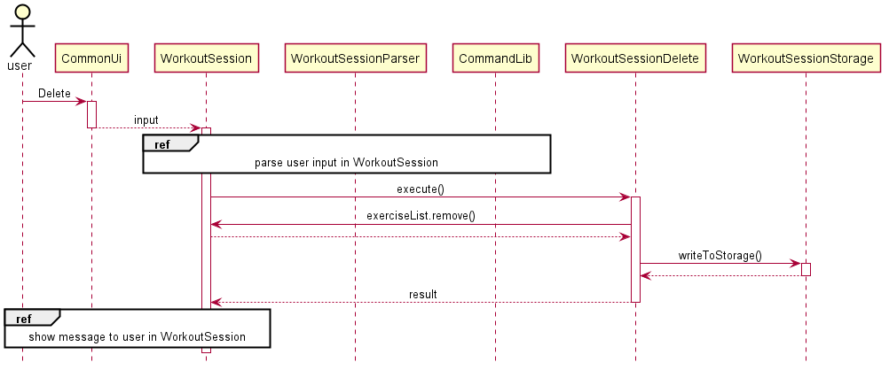

[&#8593; Return to Top](#developer-guide)
#### 4.4.1.3. <a id="listing-all-exercises-in-this-session">Listing All Exercises in This Session</a>


[&#8593; Return to Top](#developer-guide)
#### 4.4.1.4. Allowing users to view help commands


[&#8593; Return to Top](#developer-guide)
#### 4.4.1.5. Searching for related exercises

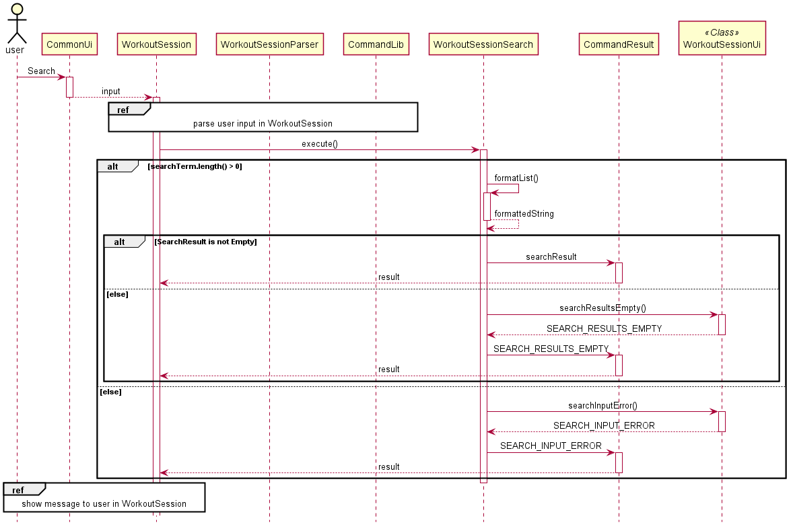
[&#8593; Return to Top](#developer-guide)
#### 4.4.1.6. Ending the workout session

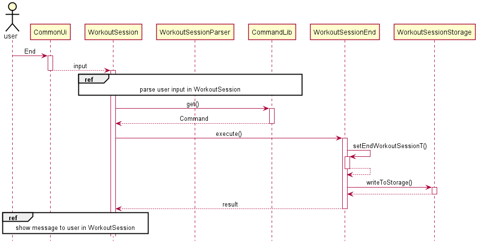
[&#8593; Return to Top](#developer-guide)
#### 4.4.2. Listing past workout sessions
The feature to list workoutSessions allows the user to view a summary of all the history workout sessions, including their index, creation date and tags.

**Implementation**
When the user attempts to list workoutSessions, the WorkoutManger, WorkoutManagerParse, ListWS and WorkoutManagerStorage class will be called upon. The following sequence of steps will then occur:

1. User executes `list /s 20201010 /e 20201025`
     1. `WorkoutManager` calls `Ui.getUserCommand()` to receive user input.
     2. `WorkoutManager` calls `WorkoutManagerParser.parse` into a string array
1. Creation of command object.
     1. Based on the parsed input, `WorkoutManager` calls `CommandLib` to return the correct Command Object `ListWS`.
1. Executing Command
    1. `WorkoutManager` calls `ListWS.execute()` to execute the command
    3. `ListWS` calls `PastRecordList.list()`
    1. `PastRecordList` will return formatted list.
    6. `WorkoutManager` returns a `CommandResult` which contains the formatted list and execution result.
1. Based on `CommandResult`, correct response will be printed to user.

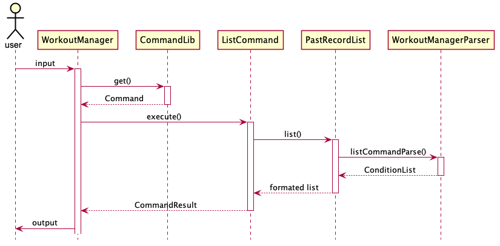

**Design considerations**
Aspects: Security of stored data

- **Alternative 1 (current choice):** call public methods of Storage class to 
print the list

    - Pros: pastRecord are private and it can only be manipulated through designed public methods. Only selected data will be printed and viewed.
    - Cons: Most methods Storage needs to be a static.

- **Alternative 2:** Storage return a readonly list of pastRecord.

    - Pros: More versatile operations can be done.
    - Cons: All data of pastRecord will be exposed.

[&#8593; Return to Top](#developer-guide)

#### 4.4.3. Editing workout session
User can anytime go back to edit a workout session created in the past such as
adding or removing exercies in that session.

Each past workout session is stored in a different file name following its creation time.
The meta information of these past records such as file name, creation time are
stored in another file which will be loaded as the program initlises.
The actual workout session record will only be loaded if needed e.g. when editting is called. 

**Implementation**
When the user attempts to edit a past workout session, the Ui, WorkoutManagerParser, CommandLib and WorkoutStorage class will be accessed and the following sequence of 
actions are called.

1. User executes `edit 1`
     1. `WorkoutManager` calls `Ui.getUserCommand()` to receive user input.
     2. `WorkoutManager` calls `WorkoutManagerParser.parse` into a string array
1. Creation of command object.
     1. Based on the parsed input, `WorkoutManager` calls `CommandLib` to return the correct Command Object `EditWS`.
1. Executing Command
    1. `WorkoutManager` calls `EditWS.execute()` with the rest of parsed input.
    3. `EditWS` calls `PastRecordList.edit()` to locate the file. If the does not exist, the action is aborted. Else, `PastRecordList` updates the meta information of the file and write to local storage. The file path will be returned.
    4. `EditWS` creates a new `WorkoutSession` Object with the file path. `WorkoutSession` is initilised by loading the data in the file.
    5.  `EditWS` calls `workoutSession.workoutSessionStart()` so that user start editing this session.
    6. After user exits this workout, `WorkoutManager` returns a `CommandResult`.
1. Based on `CommandResult`, correct response will be printed to user.

All description, warnings and response will be handled by `Ui` to ensure consistence across the app.
The following sequence diagram shows how the new command works

The sequence diagram below summarizes how editting past record works:

**Design considerations**
Past record storage and model design:  

- **Alternative 1 (current choice):** store past workout sessions in different files and their meta information in a separate file

    - Pros: Initialization will be faster as data loaded grows little even in long terms. 
    - Cons: Deleting files and creating files need to handle file names carefully.

- **Alternative 2:** Load all past records during initialization.

    - Pros:  Run time can retrieve data faster as there is no need to access data in hard disk. 
    - Cons: The application initialization will grow quickly as the application scales.

[&#8593; Return to Top](#developer-guide)
#### 4.4.4. Deleting a workout session
User can delete a workout session created in the past by giving its index.

Each past workout session is stored in a different file name following its creation time. The meta information of these past records such as file name, creation time are stored in another file which will be loaded as the program initlises. When the user tries to delete a file, the application refers to the meta information of the file to locate the file and delete it. Then the meta information of the record will be deleted.

User can clear all data by iteratively delete the record until the meta data file is empty. To simplify that, user can use `clear` command to achieve that.

**Implementation**

When the user attempts to delete a past workout session, the Ui, WorkoutManagerParser, CommandLib
and WorkoutStorage class will be accessed and the following sequence of actions are called.

1. User executes `delete 1` or `clear`
     1. `WorkoutManager` calls `Ui.getUserCommand()` to receive user input.
     2. `WorkoutManager` calls `WorkoutManagerParser.parse` into a string array
1. Creation of command object.
     1. Based on the parsed input, `WorkoutManager` calls `CommandLib` to return the correct Command Object `DeleteWS`
     or `clearWS`.
1. Executing Command
    1. `WorkoutManager` calls `DeleteWS.execute()` with the rest of parsed input.
    3. `DeleteWS` calls `PastRecorList.delete()` to locate the file. If the does not exist, the action is aborted. Else, `PastRecorList` remove the meta information of the file and delete the local storage file.
    6. After user exits this workout, `WorkoutManager` returns a `CommandResult`.
1. Based on `CommandResult`, correct response will be printed to user.

All description, warnings and response will be handled by `Ui` to ensure consistence across the app.

The sequence diagram below summarizes how deleting past record works:
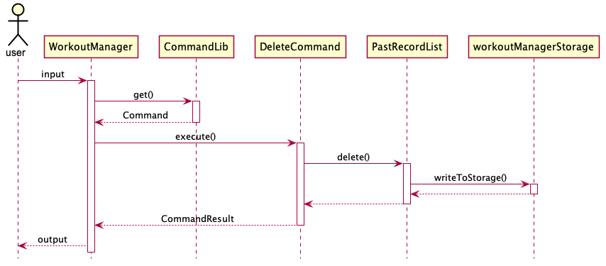

**Design considerations**

- **Alternative 1 (current choice):** Delete `workoutSession` by specifying index of it.

    - Pros: Quick and easy deletion by using ArrayList.get().
    - Cons: Lesser alternatives for the user and user would have to identify the index first by executing `list` to get index of the session to be deleted.

- **Alternative 2:** Delete `workoutSession` by specifying `workoutSession` tags or dates.

    - Pros: More alternatives for users. Can bulk delete files with certain attributes. 
    - Cons: Tags and dates does not uniquely identify the record hence may result in accidental wrong deletion.

[&#8593; Return to Top](#developer-guide)
#### 4.4.5. Searching based on conditions
The feature `search` allows the user to view a summary of all the history 
workout sessions which satisfies certain conditions.

The user can search by the date of creation, or the tags that the session has. User can put in 0
or 1 or 2 criteria during search. 


The user can attach variable number of tags after `/t` and one date after `/d`. The date must be specified in certain formats for it to be recognisable. Else, it will be treated as there is no date criteria given.
[See here](#appendix-g-supported-formats-of-date-input) for all supported formats.

The tag criterion selects sessions which contains all the tags that the user specified in the search. The date criterion selects the sessions which is created on that date. Only sessions that satisfies all conditions will be selected and displayed.

The result is displayed in a table with the index of the selected records so that users can easily do further operations on them, e.g. `delete` or `edit`.
 
 **Implementation**
 
When the user attempts to list workoutSessions, the WorkoutManger, DeleteWS, WorkoutManagerStorage and WorkoutManagerParse class will be called upon. The following sequence of steps will then occur:

1. User executes `search /t leg /d 20201017`
     1. `WorkoutManager` calls `Ui.getUserCommand()` to receive user input.
     2. `WorkoutManager` calls `WorkoutManagerParser.parse` into a string array
1. Creation of command object.
     1. Based on the parsed input, `WorkoutManager` calls `CommandLib` to return the correct Command Object `SearchWS`.
1. Executing Command
    1. `WorkoutManager` calls `SearchWS.execute()` to execute the command
    3. `SearchWS` calls `PastRecorList.search()`
    1. `PastRecorList` will call `WorkoutManagerParser.parse` to parse the arguments into an array of predicates
    1. `PastRecorList` filters the pastRecord arraylist and return a string representation of the filtered records to `WorkoutManager`
    6. `WorkoutManager` returns a `CommandResult`.
1. Based on `CommandResult`, correct response will be printed to user.

The sequence diagram below summarizes how searching record works:
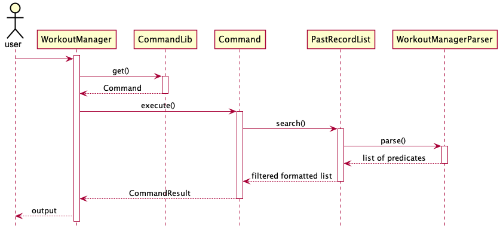
**Design considerations**
Aspects: indexing the selected results

The index of a record is not stored in the schema because it easily varies with addition and deletion. Thus given a record, searching for its index will have higher time complexity.

- **Alternative 1 (current choice):** print out the actual index of the record 
in the meta info file.

    - Pros: The index is useful for user to use for future actions.
    - Cons: Checking for the actual location complicates the search time complexity.

- **Alternative 2:** print out the index of the element in the result list.

    - Pros: Easy to implement. Low time complexity.
    - Cons: Since the index in result list is not the same as the index in actual record meta, user cannot use the index for further actions.

[&#8593; Return to Top](#developer-guide)

### 4.5. <a id="storage">Storage</a>
Storage in the application refers to storing files of user profile and workout, diet sessions into respective local subdirectories sorted based on time in a local directory called `/saves` which is in the same directory as the project root.

#### 4.5.1. <a id="storage-for-profile">Storage for Profile</a>

Storage for profile saves user profile created as `profile.json` in the `/saves/profile` directory. Profile data file is created as follows:
- `profile.json` is updated in the local hard disk after the user adds/ edits a profile by calling `ProfileAdd.execute()`/ `ProfileEdit.execute()`.
- `profile.json` content will be cleared after the user deletes a profile by calling `ProfileDelete.execute()`.

**Implementation**
Profile storage handles reading of file data by calling `loadData()` and overwriting of file data by calling `saveData()`.

[&#8593; Return to Top](#developer-guide)
#### 4.5.2. <a id="storage-for-diet">Storage for Diet</a>

Storage for diet saves diet sessions created as individual files sorted based on the time created in the `/saves/diet` directory. Each diet session file is created as follows:
- Each file is created as a json file and named as `[DATE] [TAG].json`.
- A corresponding file is updated in the local file after the user edits a diet session by calling DietSessionEdit.execute().
- A corresponding file is deleted in the local file when the user deletes a diet session by calling DietSessionDelete.execute() or clears all diet sessions by calling DietSessionClear.execute().

**Implementation**
Storage handles reading of file data by calling readDietSession() and overwriting of file data by calling writeToStorageDietSession().

[&#8593; Return to Top](#developer-guide)
#### 4.5.3. <a id="storage-for-workout">Storage for Workout</a>

Storage for workout saves workout sessions created as individual files named based on the time created in `/saves/workout` directory. The metainformation of the files such as createion date and last edit date is saved in  `/saves/workout/history.json`.

Only history.json file is load when initilizing the application. The rest of Session files are load on request, e.g. `edit`. When a new workout session is created, a new file will be stored and its meta information will be appended to `history.json`. When a workout session is deleted, the file will be removed and its record will be removed from `history.json`.


**Implementation**

Meta information file can be overwritten with `writePastRecords()` and be read with `readPastRecords()`.

[&#8593; Return to Top](#developer-guide)
### 4.6. <a id="logging">Logging</a>
Logging in the application refers to storing exceptions, warnings and messages that occur during the execution of Kitchen Helper. It was included to help developers to identify bugs and to simplify their debugging process. 

The `java.util.logging` package in Java is used for logging. The logging mechanism can be managed from the `SchwarzeneggerLogger` class through the `logger` attribute. 

All controls of the logger for the application can be viewed/ altered in the class construction. The current settings for the logger are as follow:

- All information is logged into a log file, `SchwarzeneggerLogs.log`.
- Logging is made to be displayed in the `SimpleFormatter` style where the date, class and error description are logged.

Logging Levels:
- `Level.SEVERE`: a serious failure, which prevents normal execution of the program, for end users and system administrators.
- `Level.WARNING`: a potential problem, for end users and system administrators.
- `Level.INFO`: reasonably significant informational message for end users and system administrators.
- `Level.CONFIG`: hardware configuration, such as CPU type.
- `Level.FINE`, `Level.FINER`, `Level.FINEST`: three levels used for providing tracing information for the software developers.

`SchwarzeneggerLogger` follows singleton design pattern. Thus, other classes can access the `logger` by calling `SchwarzeneggerLogger.getInstanceLogger()`, and logging can be done by invoking the function `log()`. This will ensure that all loggings will be made to the same file across the various classes. 

An example is shown below:

```
private static Logger logger = SchwarzeneggerLogger.getInstanceLogger();
logger.log(Level.WARNING, DESCRIPTION_OF_WARNING, e.toString());
```

[&#8593; Return to Top](#developer-guide)

## 5. <a id="testing">Testing</a>
### 5.1. <a id="running-tests">Running Tests</a>
There are two ways to run tests for The Schwarzenegger.

**Method 1: Using IntelliJ JUnit test runner**

- To run all tests, right-click on the `src/test/java` folder and choose `Run 'All Tests'`.
- To run a subset of tests, you can right-click on a test package, test class, or a test and choose `Run 'ABC'`.

**Method 2: Using Gradle**

- To run all tests, open a console and run the command `gradlew clean test` (MacOS/Linux: `./gradlew clean test`)
 
 > **Note:** If you are new to Gradle, refer to this [Gradle Tutorial](#https://se-education.org/guides/tutorials/gradle.html) to get more tips on how to use Gradle commands.

[&#8593; Return to Top](#developer-guide)
### 5.2. <a id="types-of-tests">Types of Tests</a>
We have use types of tests:

1. Unit tests targeting the lowest level methods/classes.<br>
e.g. profile.UtilsTest

1. Integration tests that are checking the integration of multiple code units (those code units are assumed to be working).
e.g. storage.profile.ProfileStorageTest

1. Hybrids of unit and integration tests. These test are checking multiple code units as well as how the are connected together.
e.g. logic.LogicManagerTest

[&#8593; Return to Top](#developer-guide)
## 6. <a id="dev-ops">Dev Ops</a>
### 6.1. <a id="build-automation">Build Automation</a>
We use Gradle for tasks related to build automation, such as running tests, and checking code for style compliance.

To run all build-related tasks:

1. Open a terminal in the project’s root directory.
2. Run the command:
    - Windows: `gradlew build`
    - MacOS/Linux: `./gradlew build`
3. A message stating `BUILD SUCCESSFUL` will be shown in the terminal if all tasks run successfully.<br>
Otherwise, use the error report provided to resolve the issue before trying again. 

[&#8593; Return to Top](#developer-guide)
### 6.2. <a id="continuous-integration>Continuous Integration</a>
We use Github Actions for continuous integration. No setup will be required for users who fork from the main The Schwarzenegger repository.

Whenever you create a pull request to the main repository for The Schwarzenegger:
- Various checks will automatically be executed on your pull request.
- If any checks fail, click on it to view the cause of the error, and fix it in your branch before pushing it again.
- Ensure that all checks pass before merging your pull request.

[&#8593; Return to Top](#developer-guide)

### 6.3. <a id="coverage-report">Coverage Report</a>
We use the IntelliJ IDEA’s coverage analysis tool for coverage reporting. A tutorial on how to install and use this tool can be found [here](#https://www.youtube.com/watch?v=yNYzZvyA2ik).

[&#8593; Return to Top](#developer-guide)
### 6.4. <a id="making-a-release">Making a Release</a>
You can follow the steps below to make a new release:
1. Generate the JAR file using Gradle by opening a terminal in the project’s root directory, and run the command:
    - Windows: `gradlew clean shadowJar`
    - MacOS/Linux: `./gradlew clean shadowJar`
1. Find the JAR file in the `build/libs` directory.
1. Tag the repository with the new version number (e.g. `v2.1`).
1. Create a new release using Github and upload the JAR file found in step 3.

[&#8593; Return to Top](#developer-guide)
### 6.5. <a id="managing-dependencies">Managing Dependencies</a>
Currently, the [Gson library](#https://github.com/google/gson) is being used for JSON parsing, and the [Apache Commons Lang](#https://commons.apache.org/proper/commons-lang) for being used for string processing in The Schwarzenegger. Below are 2 ways to manage these dependencies.
- Use Gradle to manage and automatically download dependencies (Recommended).
- Manually download and include those libraries in the repo (this requires extra work and bloats the repo size). 

[&#8593; Return to Top](#developer-guide)
## Appendices 
### Appendix A: Product Scope

__Target user profile__:

* Can type fast.    
* Comfortable with using command line interface.  
* Gyms regularly

[&#8593; Return to Top](#developer-guide)

### Appendix B: User Stories

|Version| As a ... | I want to ... | So that I can ...|
|--------|----------|---------------|------------------|
|v1.0|New user|View the available commands easily|I can learn more about the product before I use it.|
|v1.0|New user|Create a user profile|I add |
|v1.0|User|Edit user profile|I can change my data if something changes|
|v1.0|New user|Create a new workout session|I can start a recorded workout session|
|v1.0|User|Create a new workout session|I can start a recorded workout session|
|v1.0|User|Add moves into a workout session|I can personalise each workout session|
|v1.0|User|Delete workout session record|I can correct accidental typos|
|v2.0|User|

[&#8593; Return to Top](#developer-guide)

### Appendix C: Value proposition - Use cases

[&#8593; Return to Top](#developer-guide)

### Appendix D: Non-Functional Requirements

1. Should work on any mainstream OS as long as it has Java `11` or above installed.
2. A user with above average typing speed for regular English text (i.e. not code, not system admin commands) should be able to accomplish most of the tasks faster using commands than using the mouse.
3. Should not require user to install program file.
4. Should work for single user.
5. Should be able to run without internet connection.

[&#8593; Return to Top](#developer-guide)

### Appendix E: Glossary

* *Mainstream OS* - Windows, Linux, Unix, MacOS  
 
[&#8593; Return to Top](#developer-guide)

### Appendix F: Supported Formats of Date Input
Here shows all 12 valid formats.
    
    `yyyyMMdd HH:mm`
    `yyyy-MM-dd HH:mm`
    `yyyy MM dd HH:mm`
    
    `yyyyMMdd HHmm`
    `yyyy-MM-dd HHmm`
    `yyyy MM dd HHmm`
    
    `yyyyMMdd`
    `yyyy-MM-dd`
    `yyyy MM dd`
    
    `dd MM yyyy`
    `ddMMyyyy`
    `dd-MM-yyyy`

[&#8593; Return to Top](#developer-guide)
